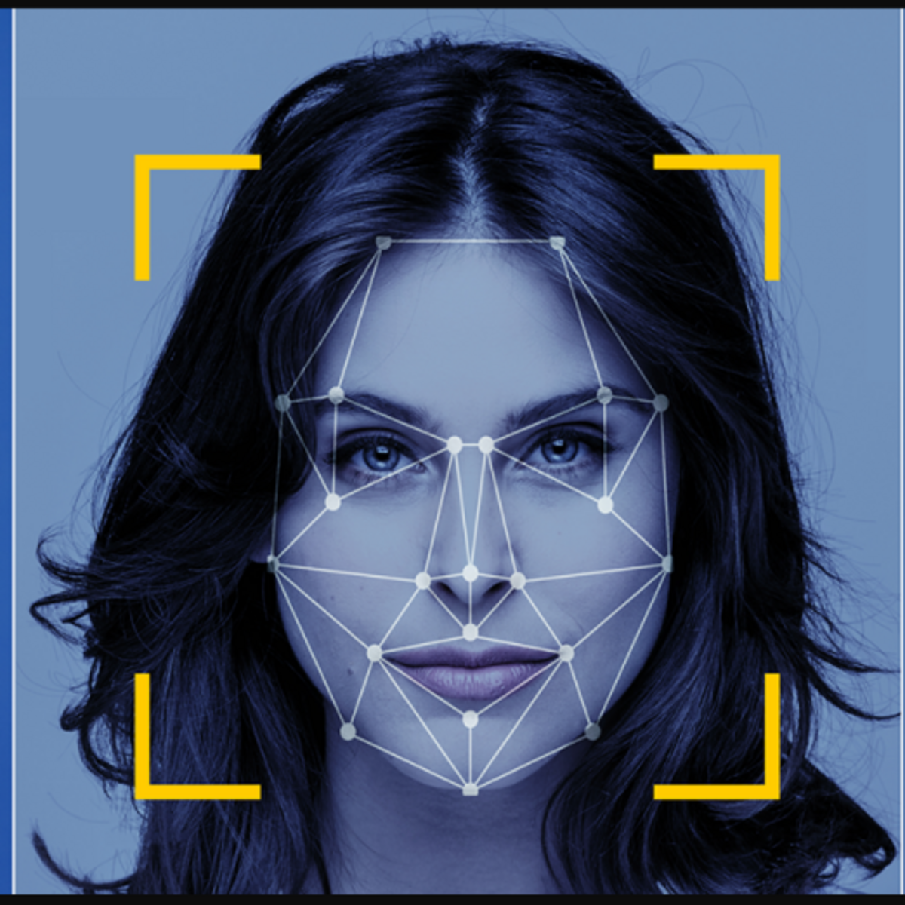
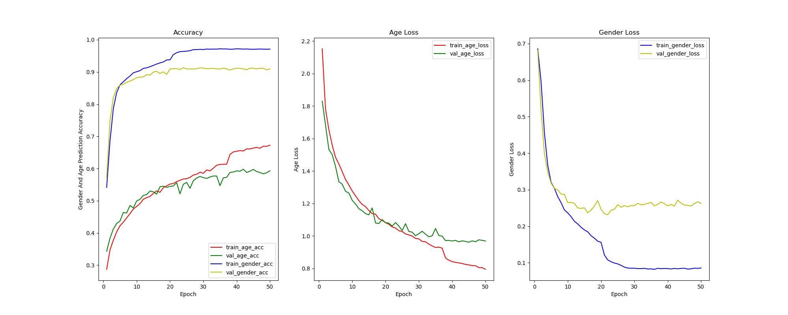
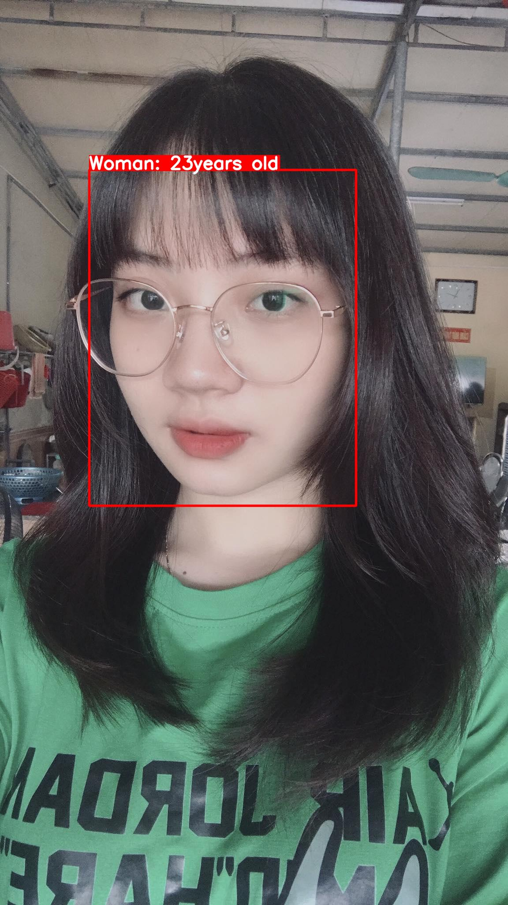
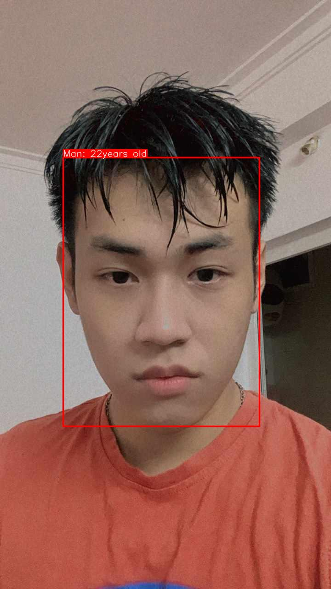
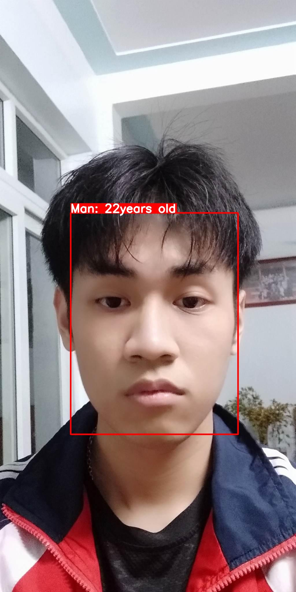
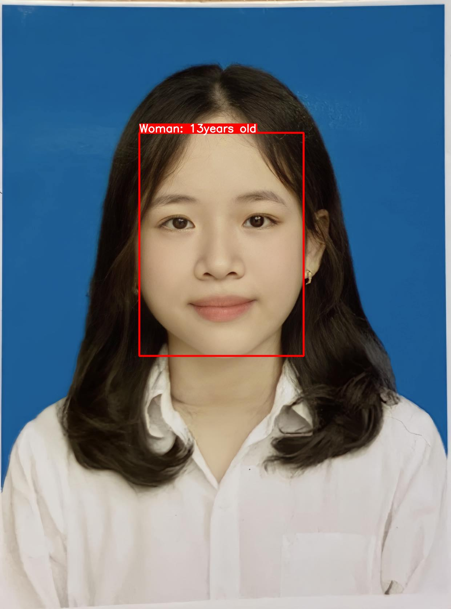
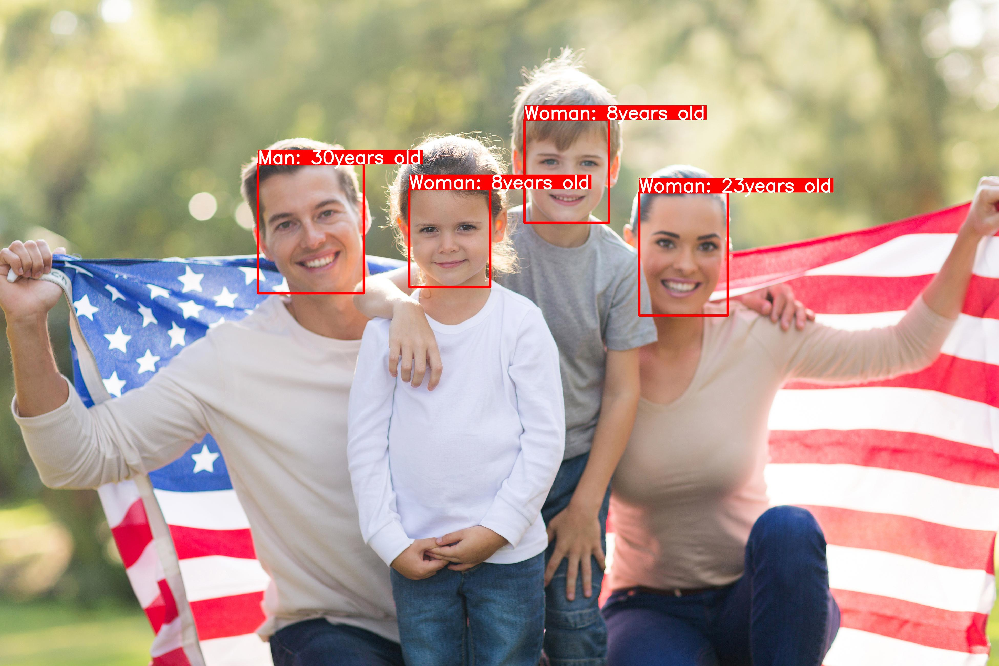
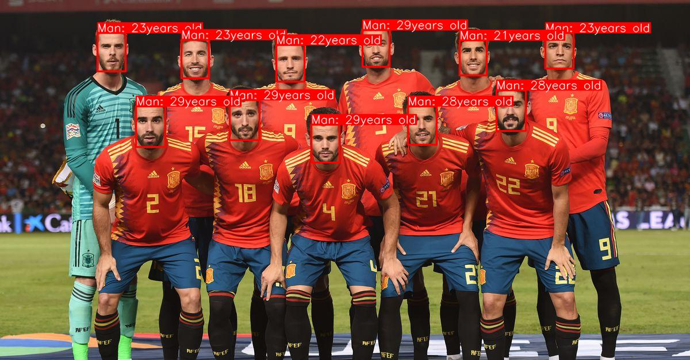
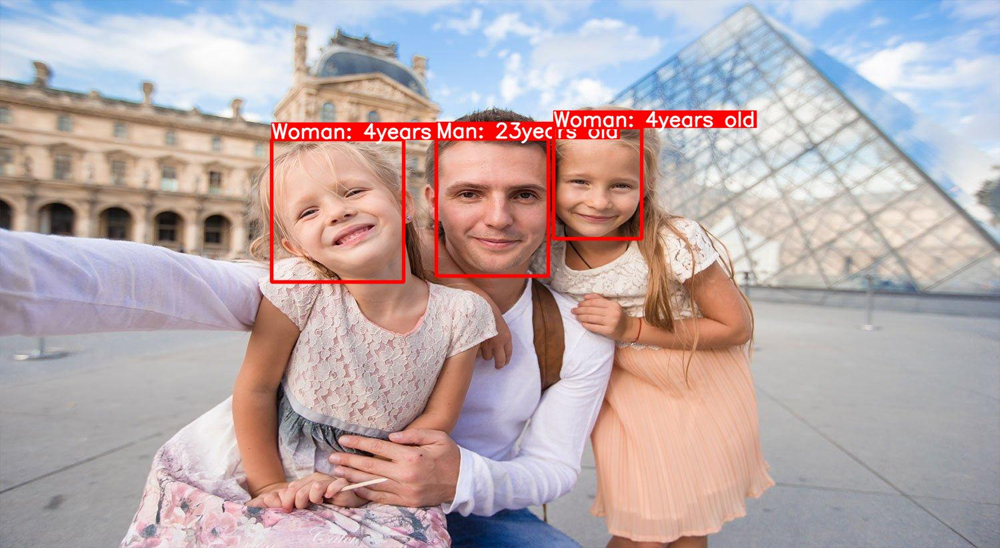

# Gender Classification and Age Estimation 

<p align="center">
 
</p>

This repository represents a deep learning project aimed at estimating age and predicting gender using the [UTKFace dataset](https://www.kaggle.com/datasets/jangedoo/utkface-new?select=UTKFace)available on Kaggle along with [MTCNN](https://github.com/timesler/facenet-pytorch) (Multi-task Cascaded Convolutional Networks) for face detection. The primary objective of this project is to accurately predict the age and gender of individuals depicted in images in the best case scenario.

## Project Components
This project comprises two main sections: "Facenet" and "AgeNet" (custom names).
 
### Facenet:
The "Facenet" section employs the Multi-task Cascaded Convolutional Networks (MTCNN) to detect and extract facial regions present within images. 

### AgeNet:
The "AgeNet" section consists of three distinct components:
1. **Gender Classification Network (VGG-Face):** Utilizing the powerful VGG-Face architecture, this network is designed to classify the gender of individuals within the detected facial regions. Its deep learning capabilities enable precise gender identification based on facial features.

2. **Age Range Classification Network:** Instead of directly predicting the exact age of each individual in the image, we will predict age ranges. This approach reduces the output complexity, making the classification more efficient.

3. **Age Estimation Network:** Unlike conventional age estimation approaches that predict only age ranges, this network refines age estimation further by predicting a specific age from within the age range determined in the previous step. This advanced approach provides more precise age predictions.

These three components are combined to form the "AgeNet" model, a comprehensive architecture for accurate age and gender prediction. The integration of multiple networks enables a more holistic understanding of facial attributes, resulting in enhanced prediction performance.


## Training Insights

Visualizing the journey of model training is crucial to understanding its performance. Below, you'll find insightful line charts that represent accuracy and error metrics throughout the training process:



Analyzing the line charts yields the following insights:

- **Gender Classification Accuracy:**
  + Training Set: Achieved an impressive gender classification accuracy of 97%.
  + Validation Set: Maintained a strong accuracy of 90% on unseen data.

- **Age Range Classification Accuracy:**
  + Training Set: Attained a satisfactory accuracy of 72% in classifying age ranges.
  + Validation Set: Demonstrated robust performance with an accuracy of 65% on validation data.

- **Age Estimation Error:**
  + Training Set: Managed age estimation with a mean absolute error of 2.9 , showcasing reasonable precision.
  + Validation Set: Maintained consistency with an estimated age error of 3.05.

The visual representation and detailed insights highlight the model's strengths and areas for potential enhancement. The exceptional gender classification accuracy reflects the model's competence in this task. Although age range classification and age estimation exhibit slightly lower accuracy and marginally higher errors, they offer opportunities for optimization and refinement.


## Installation

1. Clone the repository:

```bash
git clone https://github.com/manhcuong02/Age-Estimation.git

cd Age-Estimation
```

2. Install the required dependencies:

```bash
pip install -r requirements.txt
```

## Usage
1. Download the pretrained model weights from [ggdrive](https://drive.google.com/file/d/1_JNOsSl9kY082VVs5TcU1aoRcCGN1cBh/view?usp=sharing).
2. Run the age estimation script:

```bash
python3 predict.py --image-path your_path --weights weights_path --face-size 64 --device cpu --save-result --imshow   
```

3. Using the PyQt5 Interface (coming soon):

```bash
python3 main.py
```

## Results
Dưới đây là một số kết quả của project này:

     
   
